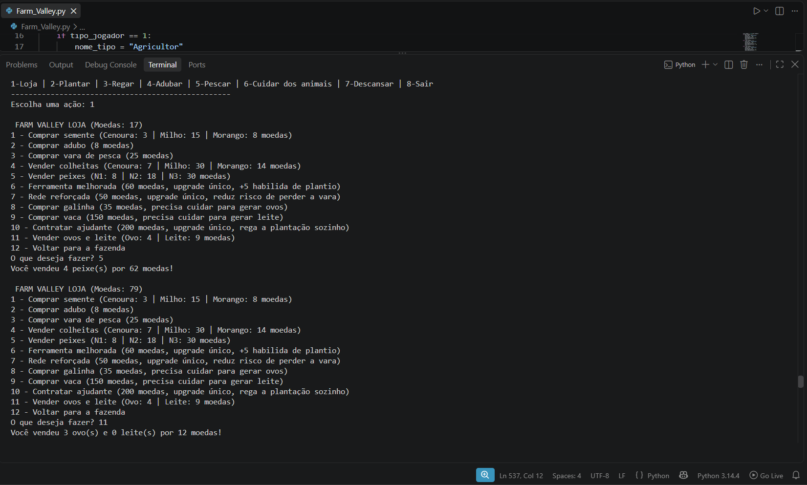
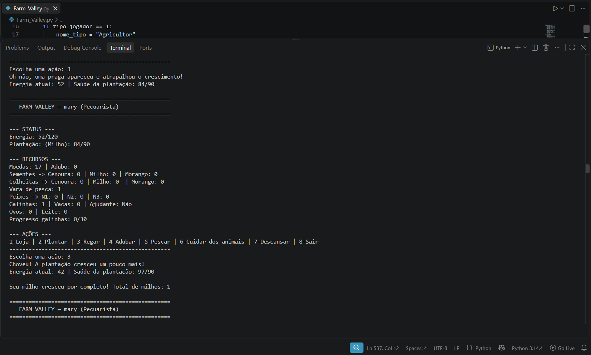
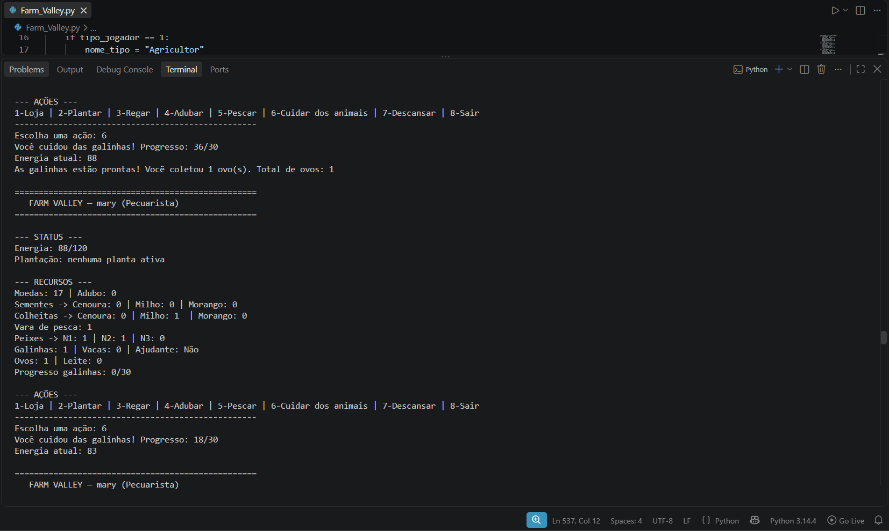

# Farm Valley
 


 
Um jogo de fazenda em texto, feito em Python puro (só biblioteca padrão), inspirado em jogos como Stardew Valley e Animal Crossing.
 
O projeto começou como um exercício de aula sobre `if/elif/else`, `while`, `try/except` e `random`, e foi crescendo até virar um simulador de fazenda completo, com economia própria, estratégia de investimento e várias mecânicas interligadas.
 

 
## Índice
 
- [Como jogar](#como-jogar)
- [Classes de personagem](#classes-de-personagem)
- [Ações disponíveis](#ações-disponíveis)
- [Plantações](#plantações)
- [Pecuária](#pecuária)
- [Pesca](#pesca)
- [Loja e upgrades](#loja-e-upgrades)
- [Conceitos de Python utilizados](#conceitos-de-python-utilizados)
- [O que aprendi construindo isso](#o-que-aprendi-construindo-isso)
- [Mais capturas de tela](#mais-capturas-de-tela)
- [Próximos passos](#próximos-passos)
## Como jogar
 
Requisitos: Python 3 instalado (nenhuma biblioteca externa é necessária).
 
```bash
python3 Farm_Valley.py
```
 
Clone o repositório ou baixe o arquivo `Farm_Valley.py` e rode o comando acima num terminal, dentro da pasta do projeto.
 
## Classes de personagem
 
No início da partida você escolhe um nome e uma classe. O Agricultor começa com 100 de energia máxima, habilidade de plantio 15, habilidade de pecuária 6 e sorte 5. O Pecuarista começa com 120 de energia máxima, habilidade de plantio 8, habilidade de pecuária 18 e sorte 8. O Herborista começa com 80 de energia máxima, habilidade de plantio 20, habilidade de pecuária 8 e sorte 10. O Pescador começa com 90 de energia máxima, habilidade de plantio 6, habilidade de pecuária 5 e sorte 15.
 
Cada classe favorece uma estratégia diferente — o Pescador domina a pesca (usa sorte), o Pecuarista é imbatível cuidando de animais, o Herborista planta mais rápido que ninguém, e o Agricultor é o mais equilibrado.
 
## Ações disponíveis
 
O menu principal oferece oito ações. Loja: comprar sementes, adubo, vara de pesca, upgrades e animais, além de vender colheitas, peixes, ovos e leite. Plantar: escolher entre cenoura, milho ou morango. Regar: faz a plantação crescer, com chance de chuva ou praga. Adubar: crescimento mais forte, mas custa adubo e mais energia. Pescar: usa a vara de pesca e pode fisgar peixes de três níveis diferentes. Cuidar dos animais: galinhas e vacas, cada uma com sua dificuldade. Descansar: recupera energia. Sair: encerra o jogo.
 
## Plantações
 
A escolha da plantação é uma decisão estratégica real — não existe uma opção "melhor", só trade-offs diferentes.
 
A cenoura tem semente barata (3 moedas), cresce rápido e vende por 7 moedas. O milho tem semente cara (15 moedas), cresce muito devagar e vende por 30 moedas. O morango tem semente de preço médio (8 moedas), cresce em tempo médio, vende por 14 moedas e tem 25% de chance de render o dobro na colheita.
 
## Pecuária
 
Diferente da plantação, os animais exigem cuidado ativo através de uma barra de progresso própria — sem depender de sorte, só de repetição e da habilidade de pecuária do personagem.
 
A galinha custa 35 moedas, é fácil de cuidar, gasta 5 de energia por cuidado e produz ovos. A vaca custa 150 moedas, é difícil de cuidar, gasta 12 de energia por cuidado e produz leite.
 
## Pesca
 
A pesca depende do atributo sorte do personagem. O resultado da pescaria soma um valor aleatório à sorte do personagem, o que define se você pega peixe de nível 1, 2, 3, ou nada. Existe também o risco de perder a vara de pesca a cada tentativa, risco esse reduzido pela sorte do personagem e pelo upgrade de rede reforçada.
 
## Loja e upgrades
 
Além de sementes, adubo e vara de pesca, a loja oferece upgrades permanentes que criam mais formas de investir as moedas ganhas: ferramenta melhorada (+5 na habilidade de plantio, para sempre), rede reforçada (reduz a chance de perder a vara de pesca) e ajudante (rega a plantação automaticamente a cada rodada, de graça).
 
## Conceitos de Python utilizados
 
Este projeto usa apenas Python puro, sem bibliotecas externas, construído em cima destes conceitos: `input()` e conversão de tipos com `int()`; `if`/`elif`/`else` para todas as regras de decisão do jogo; `while` para o loop principal e para os submenus da loja; `try`/`except` para tratar entradas inválidas sem quebrar o jogo; `random.randint()` para eventos aleatórios como clima, resultado de pesca e chance de colheita dupla; e f-strings para toda a exibição de status e mensagens.
 
## O que aprendi construindo isso
 
O maior aprendizado veio de um bug real encontrado durante o desenvolvimento: a variável que guardava a meta de crescimento da plantação era calculada antes da ação de plantar acontecer na mesma rodada. Resultado: ao plantar milho ou morango, a meta usada na verificação de colheita ainda era a de "nenhuma planta" (zero) — então a plantação "brotava" instantaneamente, sem precisar ser regada nenhuma vez.
 
A correção foi simples (recalcular a meta depois da ação, não antes), mas o processo de descobrir isso ensinou uma lição importante: testar só o "caminho feliz" não é suficiente. O bug só aparecia ao plantar qualquer coisa diferente da primeira semente gratuita do jogo — um teste um pouco mais completo já teria pego o problema antes.
 
## Mais capturas de tela
 

 

 
## Possíveis Updates - Em breve
 
- [ ] Refatorar blocos repetidos da loja em funções (`def`)
- [ ] Salvar o progresso em arquivo para continuar de onde parou  

## Sobre mim

Sou a Mariany, estudante de Engenharia de Software, e desenvolvi o Farm Valley como projeto de programação para a disciplina de Python. Quis criar algo além de um exercício convencional de dungeon, unindo lógica de programação a uma estética acolhedora.
